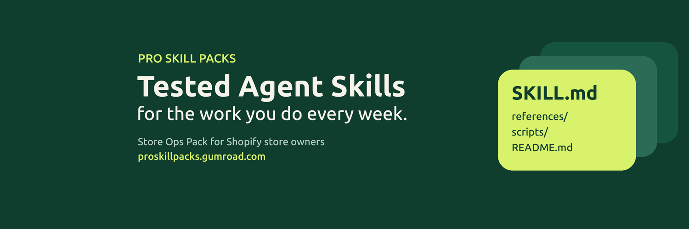

# Pro Skill Packs

*Ready-made words and checklists for the work you do every week.*

We write and test short, plain-text instructions (SKILL.md files) for specific jobs: replies to reviews, late payment emails, performance reviews, store policies and more. They work in any assistant that reads skills (Claude, Codex, Gemini CLI, Cursor, Copilot and others). Each one also has a paste-in prompt for ChatGPT or any chatbot. We make these, and some are paid.

## Start here

- Site: https://proskillpacks.github.io
- [Holiday let hosts](https://proskillpacks.github.io/hosts/): guest review replies, house rules, listing wording
- [Freelancers](https://proskillpacks.github.io/freelance/): late payment emails, UK interest calculator
- [Sales](https://proskillpacks.github.io/sales/): follow-up and cold emails
- [Managers](https://proskillpacks.github.io/managers/): performance review phrases, one-to-one questions
- [Online store owners](https://proskillpacks.github.io/stores/): review replies, refund and delay emails
- [Work](https://proskillpacks.github.io/work/): letters for hard moments at work
- Research: [how we train skills](https://proskillpacks.github.io/research/how-we-train-skills/) with all the code and runs in [skillopt-agent-browse](https://github.com/proskillpacks/skillopt-agent-browse)

## Free skills: [proskillpacks/skills](https://github.com/proskillpacks/skills)

22 free skills grouped by profession: e-commerce, marketing and SEO, freelancers, sales, support, careers, finance, data, writing and developers.

Install with any SKILL.md assistant:

    npx skills add proskillpacks/skills

Or copy the `prompt.md` from a skill folder into a chat.

## Also here

- [shopify-store-skills](https://github.com/proskillpacks/shopify-store-skills): five free skills for Shopify store owners
- [skill-check](https://github.com/proskillpacks/skill-check): a portability checker for SKILL.md files (GitHub Action, pre-commit hook or CLI). Docs: https://proskillpacks.github.io/tools/skill-check/
- Study: [how portable are the most-installed agent skills](https://proskillpacks.github.io/study/portability/)
- Paid packs: https://proskillpacks.gumroad.com

Updates: [@KaiVenturaBuild](https://x.com/KaiVenturaBuild)

Not affiliated with Shopify Inc.
